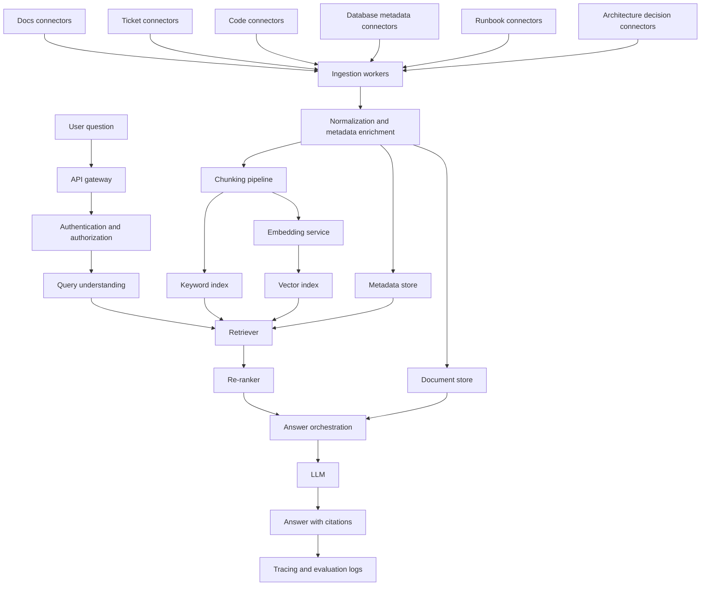

# Professional Enterprise Setup Guide

This document explains how a fully professional version of this project could be set up.

It is written for beginners, but it goes deeper than the learning phases.

The goal is to answer this question clearly:

If a company asked you to build an internal engineering knowledge assistant based on the ideas in this repository, what would you actually need to do?

This guide does not provide implementation code.

Instead, it gives you a concrete setup plan, explains the moving parts, and shows how those parts fit together in a real system.

## What Changes Between The Learning Project And An Enterprise System

The local learning project is intentionally small.

It uses:

- local synthetic files
- one local index
- one local CLI
- one simple retrieval method
- one developer running it manually

An enterprise system has to solve different problems.

It must handle:

- much larger document volume
- many source systems with different formats
- user permissions
- freshness and updates
- failures and retries
- evaluation and regression control
- observability and audits
- service deployment and operations

The core RAG loop is still the same.

You still:

1. ingest source material
2. normalize it
3. chunk it
4. attach metadata
5. index it
6. retrieve the best evidence
7. generate an answer with citations

The difference is that each step becomes a real subsystem.

## Enterprise Outcome You Are Trying To Build

For this fictional `Acme Checkout` company, the professional assistant should answer questions such as:

- Where is authentication handled?
- What does the notification module do?
- Why was retry logic added?
- Which ticket introduced this change?
- What do the docs say about this module?
- Which service writes to the `notification_deliveries` table?
- Which deployment owns the retry worker?
- Which runbook explains how to recover failed deliveries?

To answer those reliably, the system must combine multiple evidence sources and apply access control before showing the answer.

## Recommended High-Level Architecture

This is the simplest professional shape that still covers real operational needs.

## The Main Systems You Need

Think of the platform as seven parts.

### 1. Source Connectors

These are jobs or services that read from real systems.

Typical connectors:

- engineering documentation platform
- issue tracker
- source code repository
- pull request system
- database schema repository or migration folder
- runbooks and incident notes
- service catalog or ownership registry

Each connector should do four things:

1. fetch raw source records
2. store a stable external ID from the source system
3. capture timestamps for change detection
4. map the source into a common internal document model

For example, a ticket connector should not only store the ticket body.

It should also store:

- ticket ID
- title
- status
- component
- created time
- updated time
- author
- labels
- linked PRs or linked changes if available

### 2. Normalization Layer

Real data is messy.

Different systems use different field names, different markup, and different concepts.

The normalization layer turns all incoming records into one internal shape.

Recommended normalized document fields:

- `document_id`
- `external_id`
- `source_type`
- `source_system`
- `title`
- `body`
- `summary`
- `url`
- `module`
- `service_name`
- `owner_team`
- `repo_name`
- `file_path`
- `symbol`
- `ticket_id`
- `change_id`
- `database_name`
- `table_name`
- `environment`
- `tags`
- `created_at`
- `updated_at`
- `visibility`
- `access_control_tags`

This step is where you make later retrieval possible.

If metadata is inconsistent here, the rest of the system becomes difficult to trust.

### 3. Chunking Layer

You should not use one chunking strategy for every source type.

Use source-aware chunking.

Recommended rules:

- docs: split by heading, then by paragraph length
- tickets: keep title, decision, impact, and comments logically separated
- code: chunk by file overview, class, function, and sometimes method
- database schema: chunk by table or view definition
- runbooks: chunk by symptom, diagnosis, and recovery procedure

Why this matters:

- If chunks are too large, retrieval gets noisy.
- If chunks are too small, context loses meaning.
- If code is split blindly, the model sees broken functions.

In practice, you usually store both:

- a parent document record
- multiple child chunks linked back to that parent

That lets you cite the chunk but still recover broader context later.

### 4. Indexing Layer

A professional system normally uses at least three stores.

#### Document store

Stores the canonical normalized document and chunk text.

Why you need it:

- retrieval systems may only store part of the text
- answer generation often needs the full source record
- audits need the exact content used at index time

#### Metadata store

Stores structured fields used for filtering and permissions.

Why you need it:

- queries like "only show docs from the notifications module" should be precise
- permission checks should run on metadata, not brittle text matching
- dashboards need structured counts and trends

#### Search indexes

You usually want both:

- a vector index for semantic similarity
- a keyword or lexical index for exact matches

Why hybrid retrieval matters:

- exact IDs like `TKT-204` are better handled lexically
- symbol names such as `retry_payment` are often better handled lexically
- descriptive questions like "why was retry logic added" benefit from vector similarity

## Retrieval Pipeline You Would Actually Build

The retrieval path in production should usually follow this order.

1. authenticate the user
2. determine which sources the user is allowed to access
3. parse the question for filters and intent
4. run hybrid retrieval across allowed sources
5. re-rank the candidate chunks
6. build answer context from the final ranked set
7. generate the answer with citations

That order is important.

Do not retrieve everything first and think about permissions later.

Permission filtering must happen before final evidence selection.

### Query Understanding

This layer interprets the question before retrieval.

Examples:

- "Where is authentication handled?" probably needs docs plus code.
- "Which ticket introduced this change?" probably needs tickets plus change records.
- "Which table stores failed notification deliveries?" probably needs schema plus database notes.
- "Show me retry worker docs from the payments team" needs metadata filtering.

Useful outputs from query understanding:

- candidate `source_type` values
- likely `module`
- possible `ticket_id` or `change_id`
- likely `table_name` or `service_name`
- answer intent such as explanation, ownership, history, or operational procedure

In a first professional version, keep this layer simple.

Use rules and exact pattern extraction before trying more advanced model-based query planners.

### Hybrid Retrieval

A practical pattern is:

1. keyword search returns exact-ID and exact-name matches
2. vector search returns semantically similar chunks
3. a merge step combines and de-duplicates candidates
4. a re-ranker chooses the best final evidence

The re-ranker can be a cross-encoder, a smaller relevance model, or a strong lexical plus metadata scoring layer.

Its job is not to generate text.

Its job is to decide which evidence is most likely to answer the question.

### Citation Model

Each citation in a professional system should include more than a path.

Recommended citation fields:

- title
- source type
- source system
- stable URL
- file path or object path if relevant
- chunk identifier
- update timestamp
- similarity or rank score
- important metadata such as module, ticket ID, service name, or table name

This makes answers inspectable and audit-friendly.

## Access Control And Security

This is one of the biggest differences between a demo and an enterprise system.

You need a clear access model.

At minimum, each document or chunk should carry access metadata such as:

- public-internal
- engineering-only
- team-restricted
- on-call-only
- sensitive-production

Your system should enforce access in two places.

### Ingestion-time tagging

When you ingest a source, assign access labels immediately.

For example:

- incident runbooks may be engineering-only
- some tickets may be restricted to one team
- database operational notes may be restricted to production support roles

### Query-time filtering

When a user asks a question, resolve their identity and group memberships first.

Then filter the candidate source set before retrieval or at least before re-ranking.

The answer prompt should never contain unauthorized text.

That rule is critical.

### Audit Logging

Log enough to answer these questions later:

- who asked the question
- when they asked it
- which sources were searched
- which chunks were returned
- which model answered
- which citations were shown

Do not log secrets or raw credentials.

Log the operational facts needed for debugging and audits.

## Model Strategy

A professional setup usually separates model roles.

Recommended model responsibilities:

- embedding model: convert chunks and questions into vectors
- chat model: generate the final answer
- optional re-ranker model: improve relevance ordering
- optional classification model: detect question type or safety category

Do not start with many models just because you can.

Start with the minimum set that solves a clear problem.

A sensible first production stack is:

1. one embedding model
2. one chat model
3. optional lexical ranking boost before adding a dedicated re-ranker

Then add a re-ranker only if retrieval noise is still a real issue.

## Source-Specific Enterprise Setup

The assistant in this repository is about engineering knowledge, so these source types matter most.

### Documentation

What to ingest:

- architecture docs
- service docs
- onboarding docs
- decision records
- runbooks

What metadata to attach:

- module
- service name
- owner team
- doc type
- environment
- update time

### Tickets And Change Records

What to ingest:

- issue descriptions
- acceptance criteria
- comments with technical decisions
- linked pull requests
- resolution summaries

What metadata to attach:

- ticket ID
- status
- component
- labels
- assignee
- linked repo or PR IDs

### Source Code

What to ingest:

- repository metadata
- file overviews
- symbol-level chunks
- docstrings
- selected configuration files

What metadata to attach:

- repo name
- branch or commit reference used for indexing
- file path
- symbol name
- language
- module
- owner team if available

Important practice:

Index code from a known commit or release reference, not from an unspecified moving target.

Otherwise citations become difficult to trust.

### Database Knowledge

What to ingest:

- schema definitions
- migration descriptions
- repository query files
- data dictionary pages
- table ownership documentation

What metadata to attach:

- database name
- schema name
- table name
- view name
- service name
- owner team
- environment

Important distinction:

Database retrieval is not the same as live database querying.

You usually want both capabilities, but they should be separate.

- retrieval answers structural questions such as what a table is for
- live query tools answer exact runtime questions such as how many failures happened today

That separation keeps the architecture safer and easier to reason about.

## Live Data Tools

A mature assistant often needs tools in addition to retrieval.

Examples:

- run a safe read-only SQL query through an allowlisted service
- fetch deployment health from an internal service API
- fetch ownership from a service catalog

Do not let the model execute arbitrary SQL directly.

A safer pattern is:

1. classify whether the question needs live data
2. route to a restricted tool
3. validate parameters against an allowlist or typed schema
4. execute using service-side credentials
5. return structured results to the answer orchestrator

This prevents the model from turning into an unbounded operator.

## Ingestion Operations

Professional systems need scheduled refresh and failure handling.

Recommended ingestion design:

- full sync jobs for initial loads
- incremental sync jobs using `updated_at` or change tokens
- per-source dead-letter handling for failed records
- retry queues for transient failures
- metrics for document counts and chunk counts

Useful ingestion metrics:

- records fetched per source
- records normalized successfully
- chunk counts by source type
- average chunk size
- embedding failures
- indexing latency
- last successful sync time

If you were implementing this for real, build ingestion observability on day one.

Without it, debugging freshness problems becomes painful.

## Evaluation You Should Run In Production

A serious setup needs more than one manual smoke test.

You should evaluate at least four things.

### 1. Retrieval quality

Examples:

- did the expected source type appear
- did the correct ticket or module appear
- did the correct code symbol appear
- did the correct table or service appear

### 2. Answer quality

Examples:

- factual correctness against reference answers
- citation support for the main claims
- completeness for multi-part questions
- refusal behavior when evidence is weak

### 3. Permission behavior

Examples:

- restricted documents are not returned to unauthorized users
- citations do not leak restricted titles or URLs
- prompts do not contain hidden content

### 4. Operational performance

Examples:

- p50 and p95 query latency
- ingestion freshness lag
- model timeout rate
- retrieval timeout rate

The evaluation set should include realistic internal questions from multiple teams.

For this fictional domain, include categories such as:

- authentication questions
- notification delivery questions
- payment retry history questions
- ticket traceability questions
- database ownership questions
- runbook and incident-response questions

## Deployment Shape

The cleanest enterprise deployment is usually a small set of cooperating services.

Recommended service split:

### API service

Responsibilities:

- authenticate users
- receive questions
- call retrieval and answer orchestration
- return answers and citations

### Ingestion workers

Responsibilities:

- fetch source records
- normalize and chunk documents
- create embeddings
- update indexes and stores

### Search infrastructure

Responsibilities:

- vector retrieval
- keyword retrieval
- metadata filtering

### Observability stack

Responsibilities:

- traces
- logs
- metrics
- alerting

This separation prevents one large service from doing everything badly.

## Suggested Implementation Order

If a company asked you to set this up, this is the order that usually makes the most sense.

### Step 1: Define the first supported questions

Do not start with infrastructure.

Start with the exact question types the system must answer.

For example:

1. Where is authentication handled?
2. What does the notification module do?
3. Why was retry logic added?
4. Which ticket introduced this change?
5. Which service writes to `notification_deliveries`?

Those questions determine which sources you need first.

### Step 2: Define the source contract

Write down:

- which source systems are in scope
- who owns each connector
- which metadata fields are mandatory
- which access labels must exist

### Step 3: Build the normalized document model

Do this before indexing.

If you skip this step, every connector invents its own format and retrieval quality suffers.

### Step 4: Implement one connector at a time

Good first order:

1. docs
2. tickets
3. code
4. database metadata
5. runbooks

Validate each source with example questions before adding the next one.

### Step 5: Build hybrid retrieval before adding agentic behavior

A strong retriever is more valuable than an overcomplicated agent.

Start with:

- metadata filters
- keyword retrieval
- vector retrieval
- merged ranking
- citations

Only add multi-step tool orchestration when there is a clear need.

### Step 6: Add evaluation gates

Before each production release, run:

- retrieval regression tests
- permission tests
- latency checks
- citation checks

### Step 7: Add live-data tools carefully

Only after retrieval is trustworthy should you add live query tools.

And when you do, keep them narrow and governed.

## Team Responsibilities In A Real Setup

A professional system is usually not owned by one person.

Typical responsibilities look like this.

### Platform or search team

- indexing platform
- retrieval APIs
- ranking
- observability
- access control integration

### Source-owning teams

- data quality in docs, tickets, and runbooks
- ownership metadata
- source-specific validation

### Security or governance team

- access model
- audit requirements
- retention policy
- approved model usage

### Product or developer experience team

- question prioritization
- user feedback loops
- answer UX and citations

This matters because many enterprise failures are ownership failures, not model failures.

## Runbooks You Should Have

Before launch, create at least these operational runbooks.

1. Ingestion job failed for one source system
2. Embedding service unavailable
3. Vector index out of sync with metadata store
4. Users report missing citations
5. Unauthorized source appeared in an answer
6. Retrieval quality regressed after a release

Each runbook should define:

- symptoms
- dashboards to inspect
- likely causes
- immediate mitigation
- rollback steps
- long-term fix owner

## Common Mistakes To Avoid

These are the most common mistakes when teams jump from a demo to production.

### Mistake 1: Treating all content the same

Docs, code, tickets, and schema files should not all be chunked or ranked identically.

### Mistake 2: Adding agent behavior before retrieval is solid

If retrieval is weak, the agent just fails in more complicated ways.

### Mistake 3: Ignoring access control until the end

That creates redesign work and security risk.

### Mistake 4: Forgetting stable source references

If citations do not point to stable objects, users stop trusting the system.

### Mistake 5: Measuring only answer fluency

An answer that sounds good but cites the wrong ticket is still a bad answer.

## What You Would Build First For Acme Checkout

If you were asked to set up the first real enterprise version for this fictional company, a sensible first scope would be:

1. documentation connector
2. ticket connector
3. code indexing for two repositories only
4. database schema indexing for the checkout domain
5. metadata filters for `module`, `ticket_id`, `service_name`, and `table_name`
6. hybrid retrieval
7. citations with stable internal links
8. retrieval evaluation set
9. permission filtering for engineering groups

That scope is large enough to be useful, but still small enough to deliver in stages.

## A Clear Mental Model To Keep

When the system grows, think in this order:

1. source truth
2. normalized document model
3. chunk quality
4. metadata quality
5. retrieval quality
6. permission enforcement
7. answer generation
8. evaluation and operations

If you keep that order, you will make better technical decisions.

If you reverse it and start from prompt tricks, the system will look impressive but behave unpredictably.

## Final Takeaway

A professional enterprise setup is not just "the same chatbot with more documents".

It is a system with:

- governed ingestion
- consistent metadata
- hybrid retrieval
- citations that people can inspect
- access control
- evaluation gates
- operational monitoring
- carefully restricted live-data tools

That may sound like a lot, but it is still the same RAG idea you learned in the small project.

The enterprise version simply turns each part of the learning loop into a reliable subsystem with ownership, security, and observability.
