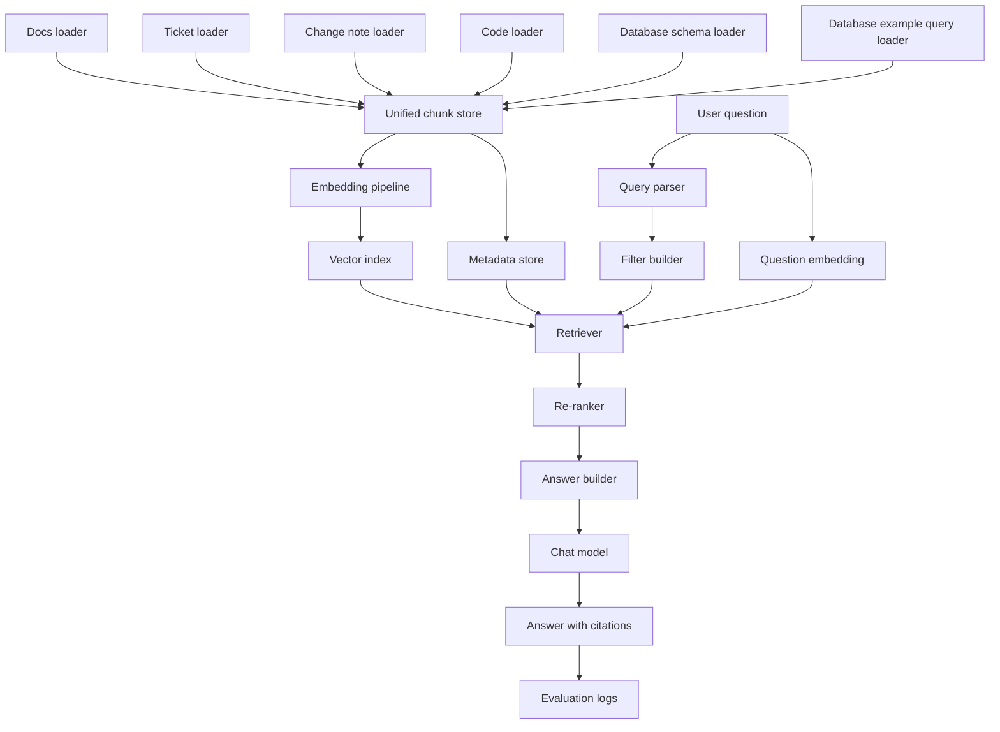

# System Roadmap

This document is the Phase 6 deliverable.

It explains how the small local learning project could grow into a more professional internal engineering knowledge assistant without jumping straight into enterprise complexity.

The repository has now implemented the first step from this roadmap: synthetic SQL schema and query retrieval using local files under `data/database`.

The goal is not to replace the beginner-friendly code in this repository.

The goal is to show a realistic path forward.

## What Stays The Same

Even in a stronger version of the system, the core idea does not change.

The assistant still needs to:

1. ingest source material
2. split it into searchable units
3. attach useful metadata
4. retrieve the best evidence for a question
5. answer with citations
6. measure whether the system is improving

The later system is more robust, but it is still built on the same loop you learned in Phase 1.

## Target Capabilities

The professional version of this project should support all of the following:

- source code retrieval
- documentation retrieval
- fake ticket retrieval
- metadata filtering
- citations
- evaluation
- database retrieval

This repository already demonstrates the first six at a learning-project scale.

Phase 6 explains how to make them stronger and how to add database retrieval in a sensible way.

## Example Questions The Final System Should Answer

The assistant should be able to answer questions like:

- Where is authentication handled?
- What does the notification module do?
- Why was retry logic added?
- Which ticket introduced this change?
- What do the docs say about this module?
- Which database table stores notification delivery history?
- Which service writes to that table?
- Did the design note and the code change agree with each other?

Those last three questions are where the roadmap moves beyond the current local demo.

## A Practical Target Architecture

Here is a simple architecture that stays realistic without becoming overbuilt.



The important idea is separation of concerns.

One part of the system prepares data.

One part stores searchable evidence.

One part answers questions.

One part measures quality.

## Recommended Source Types

The current repository already uses four source types:

- `doc`
- `ticket`
- `change`
- `code`

The professional version should add two more:

- `db_schema`
- `db_query`

### `db_schema`

This source type can represent:

- table definitions
- column descriptions
- relationships between tables
- migration summaries

Example beginner-friendly synthetic file:

```text
Table: notification_deliveries
Columns: delivery_id, channel, recipient, status, created_at
Written by: NotificationService
Purpose: stores delivery attempts for receipts and store alerts
```

### `db_query`

This source type can represent:

- SQL query examples
- repository methods that touch the database
- explanations of when data is read or written

This is the easiest way to add database retrieval without introducing a live database connection.

## Unified Metadata Model

The current metadata model is already heading in the right direction.

The professional version should standardize metadata across every source type.

Recommended shared fields:

- `source_type`
- `source_path`
- `title`
- `module`
- `owner_team`
- `ticket_id`
- `change_id`
- `symbol`
- `language`
- `database_name`
- `table_name`
- `service_name`
- `updated_at`
- `tags`

Not every source needs every field.

The important point is consistency.

If metadata is predictable, filtering and evaluation become much easier.

## Ingestion Roadmap

The current project uses small local files and a single index command.

That is exactly the right starting point.

To grow the system, extend ingestion in layers.

### Stage 1: Keep local synthetic files

Still use:

- markdown docs
- fake tickets
- fake change notes
- synthetic source code

Add:

- synthetic database schema notes
- synthetic SQL or repository examples

This keeps the project teachable.

### Stage 2: Split ingestion by source type

Instead of one generic loader path, give each source type its own ingestion step.

Example pipeline stages:

1. load docs
2. load tickets
3. load change notes
4. load code symbols
5. load database schema files
6. load database query examples

This makes debugging much easier because you can tell which source type produced bad chunks.

### Stage 3: Track ingestion metadata

Record:

- ingest time
- source count
- chunk count
- source-type count
- indexing version

This helps evaluation later because you can compare runs more honestly.

## Retrieval Roadmap

The current project uses cosine similarity over one local JSON index.

That is fine for learning.

A stronger version should evolve retrieval gradually.

### Step 1: Keep metadata filtering first

Do not drop the filter system.

As the corpus grows, filters become more important, not less.

### Step 2: Add source-aware retrieval profiles

Different source types often need different retrieval behavior.

Examples:

- code questions may prefer symbol chunks first
- ticket questions may prefer title matches and recent updates
- database questions may prefer `table_name` and `service_name` filters

### Step 3: Add hybrid retrieval

Use both:

- vector similarity
- lightweight keyword or metadata matching

Why this matters:

- symbol names often work better with keyword matching
- ticket IDs and change IDs are exact identifiers
- table names are also often exact identifiers

### Step 4: Add re-ranking

After the first retrieval pass, add a simple re-ranking stage.

That stage can prioritize:

- exact metadata matches
- title overlap
- source-type preference
- recency when relevant

This usually improves answer quality more safely than trying to make the prompt do all the work.

## Citation Roadmap

Phase 4 already improved citation formatting.

The professional version should make citations more audit-friendly.

Recommended citation structure:

- source type
- title
- source path
- symbol or table name when relevant
- ticket or change ID when relevant
- updated date
- retrieval score

For code and database sources, include location hints when possible.

Examples:

- file path plus symbol name
- table name plus example query file

The user should be able to answer this question after every response:

"Why should I trust this answer?"

## Evaluation Roadmap

Phase 5 added a small evaluation loop.

That should grow in a disciplined way.

### Retrieval evaluation

Keep measuring:

- source type hits
- module hits
- ticket hits
- change hits
- symbol hits
- expected path hits

Add later:

- table-name hits
- service-name hits
- citation diversity checks
- top-1 versus top-k comparisons

### Answer evaluation

Keep manual review for beginners.

Later, add structured answer labels such as:

- grounded
- partially grounded
- unsupported
- missed key source
- wrong source type

### Regression workflow

A stronger project should make it easy to compare two runs.

At minimum, store:

- timestamp
- index version
- settings used
- evaluation summary
- failed cases

## Database Retrieval Roadmap

Database retrieval is the biggest Phase 6 addition conceptually.

Do it with synthetic artifacts first.

### First database artifacts to add

- `data/database/schema/*.md`
- `data/database/queries/*.sql`
- `data/database/notes/*.md`

Example questions:

- Which table stores notification deliveries?
- Which query reads failed payments?
- Which service writes retry audit records?

### Suggested metadata fields

- `database_name`
- `table_name`
- `query_name`
- `service_name`
- `module`
- `updated_at`

### Why start with files instead of a live DB

Because the learning goal is retrieval over engineering knowledge, not database connectivity.

A live database adds operational complexity too early.

## Suggested Next Implementation Order After This Repository

If you wanted to keep building after Phase 6, this would be a good order:

1. add synthetic database schema and query files
2. add `db_schema` and `db_query` loaders
3. extend metadata filtering with `table_name` and `service_name`
4. update citations for database sources
5. expand the evaluation set with database questions
6. experiment with hybrid retrieval
7. experiment with simple re-ranking

This order keeps the system understandable at every step.

## Final Message Of The Roadmap

The main lesson of this project is not "add more tools."

It is this:

build the smallest version that teaches the retrieval loop clearly, then grow it with evidence, filters, evaluation, and source diversity.

That is how a toy RAG demo becomes a useful engineering assistant.