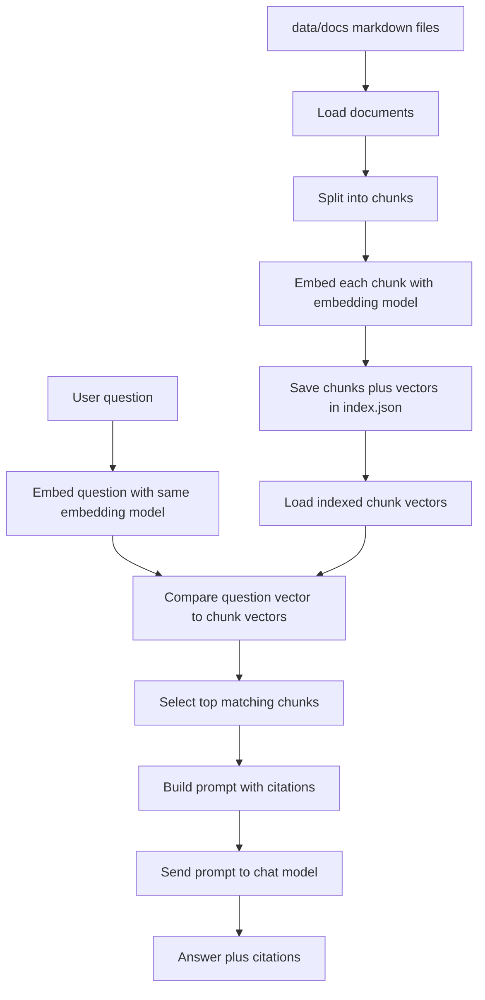

# Technical Walkthrough

This document explains what the project is doing, starting with the Phase 1 baseline and then showing what later phases add.

The goal is not only to tell you what commands to run, but to make the code easier to read and reason about.

If the code feels like "a lot all at once", read this file in order from top to bottom.

## What Phase 1 Actually Builds

Phase 1 builds a very small RAG system.

RAG means:

1. retrieve relevant text from local documents
2. give that text to the model as context
3. ask the model to answer using that context

In this project, the local documents are markdown files in `data/docs`.

The system has two separate workflows:

1. indexing
2. asking a question

The indexing workflow prepares the documents ahead of time.

The asking workflow uses the prepared index to answer a question.

## The Big Picture

Here is the full Phase 1 flow:



The key thing to notice in the diagram is that the question is embedded at query time, and it must be comparable to the chunk embeddings already stored in the index.

### Index flow

1. Read markdown files
2. Turn each file into a `Document`
3. Split each document into smaller `Chunk` objects
4. Ask Ollama for an embedding vector for each chunk
5. Save chunks plus vectors into `data/index/index.json`

### Question flow

1. Load the saved index from `data/index/index.json`
2. Ask Ollama for an embedding vector for the user question
3. Compare the question vector to all stored chunk vectors
4. Keep the top `k` most similar chunks
5. Build a prompt that contains the retrieved chunks
6. Ask the chat model to answer using that prompt
7. Print the answer and citations

## File-By-File Overview

### [src/rag_learning/cli.py](../src/rag_learning/cli.py)

This is the command-line entry point.

Its job is to:

- read command-line arguments
- decide whether the user wants `index` or `ask`
- call the `RAGChatbot`
- print results to the terminal

It does not do retrieval logic itself.

It is intentionally thin.

### [src/rag_learning/chatbot.py](../src/rag_learning/chatbot.py)

This is the orchestration layer.

It is where the main RAG workflow is assembled.

Its job is to coordinate other modules:

- configuration
- document loading
- chunking
- embeddings
- ranking
- prompt construction
- answer formatting
- optional live database execution for a tiny allowlisted set of exact-value questions

If you want to understand the system as a whole, this is the most important file to read first.

### [src/rag_learning/corpus.py](../src/rag_learning/corpus.py)

This file handles raw text data.

Its job is to:

- load markdown files
- extract titles
- split documents into chunks
- create small structured objects for later steps

This is the ingestion side of the project.

### [src/rag_learning/retrieval.py](../src/rag_learning/retrieval.py)

This file handles the vector index and similarity search.

Its job is to:

- save indexed chunks to JSON
- load them back later
- compute cosine similarity
- rank chunks by relevance

This is the retrieval side of the project.

### [src/rag_learning/filters.py](../src/rag_learning/filters.py)

This file was added in Phase 4.

Its job is to:

- define the query-time filter object
- normalize CLI input into predictable filter values
- decide whether a chunk matches the active filters

This keeps filtering logic separate from document metadata parsing.

### [src/rag_learning/citations.py](../src/rag_learning/citations.py)

This file was added in Phase 4.

Its job is to:

- convert ranked chunks into structured citation objects
- format those citations for prompts and terminal display
- group evidence by source type

This makes the evidence output easier for beginners to inspect.

### [src/rag_learning/evaluation.py](../src/rag_learning/evaluation.py)

This file was added in Phase 5.

Its job is to:

- load the JSON evaluation dataset
- run each question against the current retrieval pipeline
- score a few simple retrieval checks
- write a report that is easy to inspect later

This is intentionally lightweight.

### [src/rag_learning/db_loader.py](../src/rag_learning/db_loader.py)

This file was added when the project took the first database step after Phase 6.

Its job is to:

- read local SQL files from the synthetic database folders
- parse metadata from SQL comment headers
- build retrieval documents for schema and query sources

This keeps database retrieval aligned with the same beginner-friendly ingestion approach used for the other source types.

### [src/rag_learning/db_runtime.py](../src/rag_learning/db_runtime.py)

This file was added when the project moved from database knowledge retrieval to a tiny live-data demo.

Its job is to:

- create a seeded local SQLite database from a SQL script
- allow only a very small set of read-only `SELECT` queries
- map a few exact-value natural-language questions to safe query plans
- support both aggregate questions and small row-list questions such as the latest failed payment attempts

This is intentionally narrow.

It demonstrates how retrieval and execution can work together without pretending to be a full production query planner.

### [data/codebase/notification_repository.py](../data/codebase/notification_repository.py)

This file was added after the first live database step.

Its job is to:

- simulate the application code that writes notification delivery records
- connect a Python module to the `notification_deliveries` table through metadata
- make cross-source questions possible, such as asking which code module writes to a specific table

This is useful because professional assistants often need to connect code ownership and persistence details, not just explain them separately.

### [docs/system-roadmap.md](../docs/system-roadmap.md)

This document was added in Phase 6.

It is not source code.

Its job is to:

- translate the small learning project into a stronger future architecture
- explain which new source types should come next
- keep future implementation work grounded in the lessons from the earlier phases

### [src/rag_learning/ollama_client.py](../src/rag_learning/ollama_client.py)

This file talks to Ollama over HTTP.

Its job is to:

- send text to the embedding model
- send prompts to the chat model
- return parsed JSON responses
- raise clear errors when Ollama is unavailable or misconfigured

### [src/rag_learning/config.py](../src/rag_learning/config.py)

This file contains configuration values.

Its job is to:

- define project paths
- define default model names
- read environment-variable overrides
- create the index directory when needed

## Core Data Structures

Before looking at the functions, it helps to know the three main data shapes used by the code.

Phase 4 adds two more small data shapes that are worth knowing.

Phase 5 adds two more.

The database extension adds four more metadata fields that matter for SQL sources.

### `Document`

Defined in [src/rag_learning/corpus.py](../src/rag_learning/corpus.py).

Fields:

- `text`: full document text
- `source_path`: where the file came from
- `title`: document title
- `source_type`: currently always `doc`

Purpose:

- represent one markdown file before chunking

### `Chunk`

Defined in [src/rag_learning/corpus.py](../src/rag_learning/corpus.py).

Fields:

- `chunk_id`: stable identifier such as `authentication-chunk-1`
- `text`: chunk text
- `source_path`: original file path
- `title`: original document title
- `source_type`: current source type

Purpose:

- represent one smaller retrieval unit cut from a document

### `IndexedChunk`

Defined in [src/rag_learning/retrieval.py](../src/rag_learning/retrieval.py).

Fields:

- all `Chunk` fields
- `embedding`: vector returned by Ollama

Purpose:

- represent a chunk that is ready for vector search

### `SearchFilters`

Defined in [src/rag_learning/filters.py](../src/rag_learning/filters.py).

Fields include:

- `source_types`
- `module`
- `ticket_id`
- `change_id`
- `symbol`
- `language`
- `database_name`
- `table_name`
- `query_name`
- `service_name`
- `updated_after`

Purpose:

- represent the query-time constraints passed from the CLI to retrieval

### `Citation`

Defined in [src/rag_learning/citations.py](../src/rag_learning/citations.py).

Fields include:

- chunk identity such as `chunk_id` and `source_path`
- metadata such as `module`, `ticket_id`, `change_id`, and `symbol`
- database metadata such as `database_name`, `table_name`, `query_name`, and `service_name`
- retrieval score

Purpose:

- represent one evidence item in a format that is easy to show to the model and the user

### `EvaluationCase`

Defined in [src/rag_learning/evaluation.py](../src/rag_learning/evaluation.py).

Fields include:

- the question text
- any active filters
- expected metadata such as module, ticket, change ID, symbol, and paths
- reference points for manual answer review

Purpose:

- represent one labeled evaluation question

### `EvaluationReport`

Defined in [src/rag_learning/evaluation.py](../src/rag_learning/evaluation.py).

Fields include:

- summary counts and rates
- per-question results
- optional answers for manual review

Purpose:

- represent the output of a full evaluation run

## What Phase 4 Adds

Phase 4 does not replace the earlier RAG loop.

It sharpens it.

### More precise filtering

The CLI can now narrow retrieval with more than one kind of clue.

Examples:

- search only code and tickets
- search only the `payments` module
- search only evidence linked to `TKT-204`
- search only symbols whose name contains `retry`
- search only code chunks with `language=python`

This matters because as the project grows, a broad similarity search can retrieve evidence that is relevant in general but not precise enough for the question being asked.

### Clearer evidence presentation

Before Phase 4, citations were returned as one flat text list.

Now the code builds structured `Citation` objects and groups them by source type.

That means the terminal output becomes easier to read:

1. documentation is shown together
2. tickets are shown together
3. change notes are shown together
4. code is shown together

This is a small change in code, but a big improvement in usability.

## What Phase 5 Adds

Phase 5 adds a small measurement loop.

That matters because once you start changing chunking, filters, prompts, or source data, it gets harder to tell whether the system improved or just changed.

### The evaluation dataset

The file `eval/questions.json` stores a small list of grounded questions.

Each question includes expected metadata anchors such as:

- source types
- module
- ticket ID
- change ID
- symbol name
- source path

This is enough to check whether retrieval is landing in the right neighborhood.

### The evaluation runner

The code in [src/rag_learning/evaluation.py](../src/rag_learning/evaluation.py) runs the following loop:

1. load one case from the dataset
2. run retrieval with the same chatbot pipeline used by `ask`
3. compare retrieved citations to the expected metadata
4. record simple hit or miss metrics
5. optionally generate an answer for manual review
6. write the final report to JSON

The key design choice here is simplicity.

This project is not trying to teach a large evaluation framework yet.

It is teaching how to create a repeatable check that is easy to understand.

### The `evaluate` CLI command

Phase 5 extends the CLI with:

```text
python -m rag_learning.cli evaluate
```

This command prints a compact summary and writes a detailed report file.

If you add `--with-answers`, the report also includes model answers plus blank review fields.

That supports a practical workflow:

1. check retrieval automatically
2. inspect answer quality manually only when needed

## What Phase 6 Adds

Phase 6 is intentionally different from the earlier implementation phases.

It does not try to hide the fact that the repository is still small.

Instead, it turns that small project into a roadmap.

### Why this phase is documentation-heavy

By the end of Phase 5, the repository already teaches:

- document retrieval
- ticket retrieval
- change-note retrieval
- code retrieval
- metadata filtering
- citations
- evaluation

What it does not implement yet is database retrieval or production-style retrieval architecture.

Phase 6 solves that by documenting the next design steps clearly.

### What the roadmap contributes

The roadmap in [docs/system-roadmap.md](../docs/system-roadmap.md) explains:

- which additional source types to add
- how to unify metadata across sources
- how to evolve from vector-only retrieval to hybrid retrieval
- why re-ranking should come after good filtering, not before
- how to add database retrieval without introducing a real live database too early

This matters because many RAG projects fail by expanding too fast without preserving clarity.

## What The Database Extension Adds

After the Phase 6 roadmap was written, this repository added the first concrete database retrieval step.

That step is still intentionally local.

It does not connect to a real database.

Instead, it indexes SQL files as knowledge sources.

### Why this design fits the project

The project already teaches retrieval over:

- docs
- tickets
- change notes
- code

SQL files fit naturally into the same pattern.

They are just another form of engineering knowledge.

### The two SQL source types

The project now supports:

- `db_note` for plain-English database notes
- `db_schema` for table definitions and schema context
- `db_query` for query examples and reporting logic

That split matters because users often ask two different kinds of database questions:

1. where is this data stored?
2. how is this data read or reported?

### How SQL metadata is stored

Each SQL file begins with simple metadata comment lines such as:

```sql
-- source_type: db_schema
-- module: notifications
-- database_name: acme_checkout
-- table_name: notification_deliveries
-- service_name: NotificationService
```

This matches the project style.

It is easy to read, easy to edit, and avoids introducing a more complex parser too early.

Database notes use the same markdown front matter style as the other note sources in the repo.

That means the project can answer cross-source questions like:

- which service writes these records?
- what does the schema say about them?
- which query reads them later?

### The practical lesson of Phase 6

Phase 6 is the step where the project stops being only a tutorial and becomes a reusable engineering blueprint.

That blueprint is still intentionally conservative.

It favors:

- deliberate source modeling
- auditable citations
- repeatable evaluation
- gradual system growth

## Execution Flow: `python -m rag_learning.cli index`

This section follows the actual runtime order.

### Step 1: Python enters `main()` in [src/rag_learning/cli.py](../src/rag_learning/cli.py)

The `main()` function does four things:

1. builds the argument parser
2. reads the command-line arguments
3. creates a `RAGChatbot`
4. dispatches to either `build_index()` or `ask()`

For the `index` command, it calls:

```python
chunk_count = chatbot.build_index()
```

### Step 2: `RAGChatbot` is created in [src/rag_learning/chatbot.py](../src/rag_learning/chatbot.py)

The constructor is:

```python
def __init__(self, settings: Settings | None = None) -> None:
    self.settings = settings or Settings()
    self.ollama = OllamaClient(self.settings.ollama_base_url)
```

What this does:

- creates a `Settings` object if one was not passed in
- creates an `OllamaClient` using the configured base URL

Why this matters:

- the chatbot now knows where Ollama is
- it also knows which models and chunk settings to use

### Step 3: `build_index()` loads the markdown documents

The first important line is:

```python
documents = load_markdown_documents(DOCS_DIR)
```

`DOCS_DIR` comes from [src/rag_learning/config.py](../src/rag_learning/config.py).

It points to:

```text
data/docs
```

Inside `load_markdown_documents()` in [src/rag_learning/corpus.py](../src/rag_learning/corpus.py):

1. the code loops over all `*.md` files in `data/docs`
2. each file is read as UTF-8 text
3. the title is extracted from the first markdown heading if possible
4. a `Document` object is created and added to a list

Important detail:

```python
source_path=str(path.relative_to(docs_dir.parent.parent))
```

This stores a relative path like `data/docs/authentication.md` instead of a full absolute path.

That is useful because:

- the saved index is easier to read
- citations are shorter and cleaner

### Step 4: documents are split into chunks

Next, `build_index()` calls:

```python
chunks = chunk_documents(
    documents,
    chunk_size=self.settings.chunk_size,
    chunk_overlap=self.settings.chunk_overlap,
)
```

Why chunking is needed:

- long files are often too broad for precise retrieval
- embeddings work better when each chunk contains one focused idea
- smaller chunks give more specific citations

Inside `chunk_documents()`:

1. loop over each `Document`
2. call `split_text()` on the document text
3. create a `Chunk` object for every piece
4. assign a `chunk_id` like `retries-chunk-1`

### Step 5: `split_text()` performs simple chunking

This function does not use a framework. It uses a small manual algorithm.

What it does:

1. normalizes whitespace with:

```python
cleaned_text = " ".join(text.split())
```

This removes repeated spaces and line breaks.

2. checks that overlap is smaller than chunk size

```python
if chunk_overlap >= chunk_size:
    raise ValueError("chunk_overlap must be smaller than chunk_size")
```

3. walks through the text using `start` and `end` character positions

4. tries to cut on a space boundary instead of in the middle of a word

```python
boundary = cleaned_text.rfind(" ", start, end)
```

5. moves forward by less than a full chunk size so the next chunk overlaps the previous one

Why overlap exists:

- ideas can span chunk boundaries
- overlap keeps some shared context between neighboring chunks

### Step 6: each chunk is embedded with Ollama

After chunking, `build_index()` runs this loop:

```python
for chunk in chunks:
    embedding = self.ollama.embed(self.settings.embed_model, chunk.text)
    indexed_chunks.append(IndexedChunk.from_chunk(chunk, embedding))
```

This is one of the most important parts of RAG.

What happens here:

1. send chunk text to the embedding model
2. get back a vector such as `[0.12, -0.03, ...]`
3. combine the vector with the chunk metadata
4. store the result as an `IndexedChunk`

Why embeddings matter:

- they turn text into numeric vectors
- similar meanings should produce closer vectors
- retrieval becomes a similarity search problem

### Step 7: `OllamaClient.embed()` calls the Ollama API

Inside [src/rag_learning/ollama_client.py](../src/rag_learning/ollama_client.py), `embed()` first tries the newer endpoint:

```python
response = self._post_json("/api/embed", payload)
```

If that fails with HTTP 404, it falls back to the older endpoint:

```python
response = self._post_json("/api/embeddings", legacy_payload)
```

Why the fallback exists:

- Ollama versions differ
- some installations expose the newer API shape
- others still use the older one

This makes the project more robust across local setups.

### Step 8: the index is written to disk

At the end of `build_index()`, the code calls:

```python
save_index(indexed_chunks)
```

Inside `save_index()` in [src/rag_learning/retrieval.py](../src/rag_learning/retrieval.py):

1. create `data/index` if it does not exist
2. convert all `IndexedChunk` objects into dictionaries
3. write the result to `data/index/index.json`

Why JSON was chosen here:

- easy to inspect by hand
- no external database required
- good for learning the structure

Why JSON is not the long-term solution:

- it gets slow as data grows
- it loads the whole index into memory
- it is only appropriate for a small learning project

## Execution Flow: `python -m rag_learning.cli ask "..."`

Now look at the question-answering path.

### Step 1: the CLI receives the question

In [src/rag_learning/cli.py](../src/rag_learning/cli.py), the `ask` subcommand defines one positional argument:

```python
ask_parser.add_argument("question", help="Question to ask the chatbot")
```

When you run:

```powershell
python -m rag_learning.cli ask "Where is authentication handled?"
```

that string becomes `args.question`.

Then the CLI calls:

```python
result = chatbot.ask(args.question)
```

### Step 2: `ask()` loads the saved index

The first line in `RAGChatbot.ask()` is:

```python
indexed_chunks = load_index()
```

Inside `load_index()`:

1. check whether `data/index/index.json` exists
2. if it does not exist, raise a helpful error telling the user to run `index` first
3. if it exists, read the JSON file
4. rebuild `IndexedChunk` objects from the stored dictionaries

This gives the system all previously embedded document chunks.

### Step 3: the question is embedded

Next line:

```python
query_embedding = self.ollama.embed(self.settings.embed_model, question)
```

This is important because the question and the chunks must live in the same vector space.

If you embed the documents with one model and the question with a different incompatible model, similarity ranking becomes meaningless.

That is why both use the configured embedding model.

### Step 4: chunks are ranked by cosine similarity

Next line:

```python
ranked = rank_chunks(query_embedding, indexed_chunks, top_k=self.settings.top_k)
```

Inside `rank_chunks()`:

1. compare the query vector to each stored chunk vector
2. compute a similarity score for each pair
3. sort scores from highest to lowest
4. keep only the top `k` results

The similarity function is `cosine_similarity()`.

### Step 5: how cosine similarity works here

The code is:

```python
numerator = sum(a * b for a, b in zip(left, right))
left_norm = math.sqrt(sum(value * value for value in left))
right_norm = math.sqrt(sum(value * value for value in right))
return numerator / (left_norm * right_norm)
```

Conceptually, this measures how aligned two vectors are.

- a higher score means the vectors point in more similar directions
- a lower score means they are less related

Why this is useful:

- it compares semantic direction instead of raw magnitude
- it is one of the simplest standard tools for vector search

You do not need to memorize the math immediately. For this project, the key idea is:

- question vector close to chunk vector means "this chunk is probably relevant"

### Step 6: the retrieved chunks are turned into prompt context

Next line:

```python
context = self._build_context(ranked)
```

Inside `_build_context()` the code creates sections like this:

```text
Citation: authentication-chunk-1 (data/docs/authentication.md)
Similarity: 0.812
Text: The authentication module is the main entry point...
```

Why include similarity and citations in the context string:

- the model can see where the evidence came from
- you can inspect the prompt format more easily during learning
- the final output can reference those citation IDs

### Step 7: the final prompt is built

Then `ask()` calls:

```python
prompt = self._build_prompt(question, context)
```

This combines:

- an instruction telling the model to stay grounded in context
- the user question
- the retrieved context text

The prompt text is intentionally simple.

That is a teaching choice.

Later phases can experiment with better prompt design.

### Step 8: the chat model generates an answer

Next line:

```python
answer = self.ollama.chat(self.settings.chat_model, prompt)
```

Inside `OllamaClient.chat()`:

1. create a system message
2. create a user message containing the prompt
3. call `/api/chat`
4. extract `message.content` from the JSON response

The system message says:

- answer only from provided context
- clearly state when context is insufficient

This is how the project tries to reduce unsupported answers.

### Step 9: citations are prepared for terminal output

After the answer is generated, `ask()` builds citation strings:

```python
citations = [self._citation_text(chunk) for _, chunk in ranked]
```

Each citation looks like:

```text
authentication-chunk-1 (data/docs/authentication.md)
```

These are returned inside `AnswerResult`.

### Step 10: the CLI prints the result

Back in [src/rag_learning/cli.py](../src/rag_learning/cli.py), the code prints:

1. `Answer:`
2. the model response
3. `Citations:`
4. one citation per line

That is the full Phase 1 output path.

## Why The Code Is Split Into Modules

If this feels like many files for a small project, that is a fair reaction.

The reason for the split is educational clarity.

Each file has one main responsibility:

- CLI file: user interaction
- chatbot file: workflow orchestration
- corpus file: data loading and chunking
- retrieval file: index storage and ranking
- Ollama file: model API calls
- config file: paths and settings

If everything were put into one file, the program would be shorter, but harder to study.

## What Is Stored In `data/index/index.json`

The JSON file contains a list of indexed chunks.

Each entry stores:

- chunk metadata
- chunk text
- embedding vector

Conceptually, one item looks like this:

```json
{
  "chunk_id": "authentication-chunk-1",
  "text": "The authentication module is the main entry point...",
  "source_path": "data/docs/authentication.md",
  "title": "Authentication Module",
  "source_type": "doc",
  "embedding": [0.12, -0.03, 0.44]
}
```

The real vector is much longer than the short example above.

## Why There Are Two Different Models

The configuration uses:

- one chat model
- one embedding model

That is normal.

The chat model is good at producing language.

The embedding model is good at turning text into vectors for similarity search.

These are different tasks.

Using a dedicated embedding model usually gives more reliable retrieval.

## Important Beginner Mental Model

Try to think of the program as two layers.

### Layer 1: retrieval layer

This layer answers:

- which text snippets are probably relevant?

Relevant code:

- `load_markdown_documents()`
- `chunk_documents()`
- `split_text()`
- `embed()`
- `save_index()`
- `load_index()`
- `rank_chunks()`
- `cosine_similarity()`

### Layer 2: generation layer

This layer answers:

- given the retrieved snippets, how should the final answer be written?

Relevant code:

- `_build_context()`
- `_build_prompt()`
- `chat()`

RAG works because retrieval happens before generation.

## Common Questions About The Code

### Why not just send the whole document set to the model?

Because:

- context windows are limited
- irrelevant text makes answers noisier
- retrieval is the mechanism that narrows the evidence

### Why not use LangChain immediately?

Because this project is trying to teach the mechanics first.

If you understand this version, you will understand what a framework is abstracting away.

### Why are chunks based on characters instead of tokens?

Because character-based chunking is easier to explain and implement.

It is not the most advanced option, but it is good for learning.

### Why is the index rebuilt manually?

Because Phase 1 keeps ingestion explicit.

Later phases can add incremental indexing or smarter persistence.

## Suggested Reading Order In The Code

If you want the least confusing order, read files in this sequence:

1. [src/rag_learning/config.py](../src/rag_learning/config.py)
2. [src/rag_learning/cli.py](../src/rag_learning/cli.py)
3. [src/rag_learning/chatbot.py](../src/rag_learning/chatbot.py)
4. [src/rag_learning/corpus.py](../src/rag_learning/corpus.py)
5. [src/rag_learning/retrieval.py](../src/rag_learning/retrieval.py)
6. [src/rag_learning/ollama_client.py](../src/rag_learning/ollama_client.py)

That order starts with the simplest ideas and delays the lower-level HTTP details until the end.

## Simple Debugging Strategy

If something stops working, debug in this order.

### If `index` fails

Check:

1. is Ollama running?
2. does `data/docs` contain markdown files?
3. do the configured model names exist in Ollama?
4. is `chunk_overlap` smaller than `chunk_size`?

### If `ask` fails

Check:

1. did you run `index` first?
2. does `data/index/index.json` exist?
3. does the embedding model still work?
4. does the chat model still work?

### If answers are poor

Check:

1. are the retrieved citations relevant?
2. should chunk size be smaller?
3. should `top_k` be larger or smaller?
4. is the source documentation too vague?

## What You Should Understand After Reading This

You do not need to memorize every function.

The important understanding is this:

1. documents are loaded and chunked
2. chunks are converted into embeddings
3. embeddings are stored in an index
4. the question is embedded the same way
5. similar chunks are retrieved
6. the model answers from those chunks
7. citations show what evidence was used

If that mental model is clear, then the project is doing its job.

## Phase 2 Additions

Phase 2 keeps the same overall RAG loop, but it upgrades the input corpus and retrieval controls.

The key idea is simple:

Phase 1 answered questions from docs.

Phase 2 answers questions from docs, tickets, and change notes, while keeping the system readable for beginners.

## New Source Types

The project now indexes three synthetic source folders:

1. `data/docs`
2. `data/tickets`
3. `data/changes`

Why that matters:

- docs explain what the system does
- tickets explain why work was requested
- change notes explain what was delivered

That combination is much closer to a real internal engineering assistant.

## New File: `metadata.py`

[src/rag_learning/metadata.py](../src/rag_learning/metadata.py) introduces two important ideas.

### `DocumentMetadata`

This is a small structured container for metadata attached to a document.

It currently carries fields such as:

- `source_type`
- `module`
- `ticket_id`
- `change_id`
- `updated_at`

### `SearchFilters`

This stores optional user filters from the CLI.

It currently supports:

- `source_type`
- `module`
- `ticket_id`

Why this split is useful:

- `DocumentMetadata` describes the indexed data
- `SearchFilters` describes what the user wants to narrow down

## Front Matter Parsing

Phase 2 adds a very small front matter parser.

Example file shape:

```markdown
---
title: Ticket TKT-204: Add Retry Logic for Payment Gateway
source_type: ticket
module: payments
ticket_id: TKT-204
updated_at: 2026-03-11
---
```

The parser reads those key-value pairs before the markdown body.

This is intentionally simple.

It avoids adding a YAML dependency while still teaching the main idea: retrieval works better when chunks carry structured context.

## Phase 2 Indexing Flow

The `index` command still follows the same broad steps, but the load stage is wider.

### Step 1: `load_project_documents()` gathers all source folders

Instead of reading only `data/docs`, the project now loops through docs, tickets, and changes.

Each markdown file becomes a `Document` with both text and metadata.

### Step 2: document metadata is copied into chunks

When `chunk_documents()` creates a `Chunk`, it now keeps fields such as `module`, `ticket_id`, and `change_id`.

That means metadata survives the split into smaller retrieval units.

This is important because retrieval happens at chunk level, not whole-file level.

### Step 3: `IndexedChunk` stores vectors plus metadata

The indexed JSON now contains richer entries.

Conceptually, an item now looks more like this:

```json
{
    "chunk_id": "ticket-ticket-retry-logic-chunk-1",
    "source_type": "ticket",
    "module": "payments",
    "ticket_id": "TKT-204",
    "text": "Store test runs showed intermittent payment gateway failures...",
    "embedding": [0.12, -0.03, 0.44]
}
```

The exact vector is much longer, but the important change is that retrieval units are now easier to filter and inspect.

## Phase 2 Retrieval Flow

### Step 1: the CLI turns flags into `SearchFilters`

The `ask` command can now accept:

- `--source-type`
- `--module`
- `--ticket-id`

The CLI turns those values into a `SearchFilters` object.

### Step 2: ranking only considers matching chunks

In [src/rag_learning/retrieval.py](../src/rag_learning/retrieval.py), `rank_chunks()` now checks metadata filters before scoring similarity.

That means the system can answer questions like:

- “show me only ticket evidence for retry logic”
- “search only the notifications module”
- “find evidence linked to TKT-204”

This is still simple filtering, but it is an important step toward more realistic retrieval behavior.

### Step 3: citations now expose useful metadata

The citation text now includes fields such as:

- source path
- source type
- module
- ticket ID
- change ID
- update date

Why that matters:

- you can tell whether the answer came from a doc, ticket, or change note
- you can inspect whether the correct module was retrieved
- you can trace a change back to a ticket more easily

## What Phase 2 Teaches

Phase 2 teaches an important practical lesson:

retrieval quality is not only about embeddings.

It is also about the shape of your source data.

Even a small amount of structure can make the system feel much more useful.

In this project, that structure comes from:

- separate source folders
- front matter metadata
- chunk-level metadata fields
- user-facing filters

## Good Beginner Experiments For Phase 2

Try these in order:

1. Ask `Why was retry logic added?` without filters.
2. Ask the same question with `--source-type ticket`.
3. Ask `What changed for this ticket?` with `--ticket-id TKT-204`.
4. Ask `What changed in the notification module?` with `--module notifications`.
5. Edit one ticket or change note, rebuild the index, and compare the citations.

Those experiments make the value of metadata much easier to see.

## What Phase 2 Still Does Not Solve

Phase 2 is stronger than Phase 1, but it is still intentionally small.

It does not yet include:

- source code retrieval
- hybrid keyword plus vector search
- re-ranking
- formal evaluation
- database retrieval

Those are later phases.

## Phase 3 Additions

Phase 3 adds a small synthetic Python codebase and makes it searchable alongside docs, tickets, and change notes.

That means the assistant can now answer two different kinds of questions from one index:

- conceptual questions from docs and tickets
- implementation questions from code

## New Source Folder: `data/codebase`

The codebase folder contains small Python modules that simulate an internal checkout backend.

Examples:

- `auth_service.py`
- `notifications.py`
- `retry_helper.py`
- `payment_gateway.py`

These files are intentionally tiny.

They are there to teach retrieval over code, not to act as a full application.

## New File: `code_loader.py`

[src/rag_learning/code_loader.py](../src/rag_learning/code_loader.py) is the main Phase 3 addition.

Its job is to:

- read Python files from `data/codebase`
- parse them with Python's `ast` module
- create one overview document per file
- create one symbol document per top-level function or class
- attach metadata such as module, symbol, ticket ID, and language

Why that matters:

- overview documents help with broad questions like “what does this module do?”
- symbol documents help with focused questions like “which function performs the retry loop?”

## Why Use `ast`

The code loader uses Python's built-in abstract syntax tree parser instead of regex.

That is the right tradeoff here because it stays beginner-readable while still correctly identifying top-level classes and functions.

## Phase 3 Ingestion Flow

### Step 1: markdown and code are loaded differently

`load_project_documents()` in [src/rag_learning/corpus.py](../src/rag_learning/corpus.py) now combines:

- markdown documents from docs, tickets, and changes
- code documents from the code loader

This is a useful architectural step.

The project now has multiple source-specific ingestion paths that all end in the same `Document` shape.

### Step 2: code documents include symbol metadata

Code documents can carry fields such as:

- `source_type=code`
- `module`
- `symbol`
- `ticket_id`
- `language=python`

That gives the retriever more context and gives the user clearer citations.

### Step 3: code uses a different splitter

Phase 3 adds `split_code_text()` in [src/rag_learning/corpus.py](../src/rag_learning/corpus.py).

Why not reuse plain text chunking?

Because code readability depends on line structure and indentation much more than prose does.

The code splitter keeps lines together and uses line-based overlap so retrieved code is easier to inspect.

### Step 4: chunk IDs can include symbol names

If a code document represents a specific symbol, the chunk ID now includes that symbol name.

That makes citations like this possible:

```text
code-retry-helper-retry-payment-call-chunk-1
```

That is more informative than a file-only identifier.

## Phase 3 Retrieval Flow

The retrieval algorithm is still cosine similarity over embeddings.

What changed is the evidence pool.

Now the top matches can come from:

- docs
- tickets
- change notes
- code overviews
- code symbols

That lets one question surface both an explanation and an implementation location.

## Example Questions That Phase 3 Unlocks

Try questions like:

1. `Where is authentication handled?`
2. `Which function performs the retry loop?`
3. `Which code module sends receipts?`
4. `What code is linked to ticket TKT-204?`
5. `What do the docs and code say about notifications?`

You can also narrow to only code evidence with `--source-type code`.

## What Phase 3 Still Does Not Solve

Phase 3 gives you multi-source retrieval, but it is still deliberately small.

It does not yet include:

- better citation grouping
- richer query-time filtering
- evaluation
- database retrieval
- live connectors to external tools

Those are later phases.